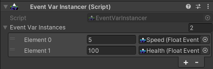

# Quickstart Guide
1. From the Assets/Create menu, navigate to Assets > Create > BardicBytes > EventVars for all included EventVar types like BoolEventVar and StringEventVar and create a new EventVar asset. Import the TypedEventVars sample for even more options.
2. Reference this EventVar asset from a script or UnityEvent such as on a Unity UI Button component.
3. Add listeners via script or use an EventVarListener component to react to the event being raised.


[Overview](overview.md)

[Samples](samples.md)

## Duplicating EventVar assets

The EventVar system caches the GUID Unity's asset database. If you duplicate an EventVar, the new asset will have the same GUID cached. There is a couple ways to fix this easy and automatically, but my laptop is running out of power and I need to save. good luck!

## EventVarInstancer
[EventVarInstancer code documentation](classes/EventVarInstancer.md)

Add the EventVarInstancer component to any game objects.


For every EventVar that this GameObject will maintain a personal copy of, add an entry to the EventVarInstances list.

When the object wakes up, the instancer component will do two things.
1. clone each EventVar in the list
2. set the "initial value" of the clone to the relative value in the inspector of the EventVarInstancer.

The asset referenced still exists and maintains it's own values and events.

## EventVar Fields
[EventVar Field code documentation](classes/EventVarInstancer.md)

```
    public FloatEventVar.Field _moveSpeed;
```